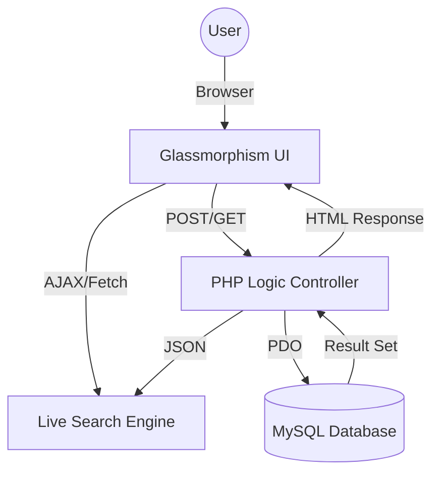

# 🌾 Ethio Farmers Market
### *Harvesting Excellence. Empowering Communities.*

---

> [!IMPORTANT]
> **Ethio Farmers Market** is a premium, full-stack e-commerce solution designed specifically for the Ethiopian agricultural landscape. It connects local highland farmers directly to urban consumers through a high-performance, secure, and visually stunning digital marketplace.

---

## 📌 Project Overview

**Ethio Farmers Market** solves a critical real-world problem by eliminating exploitative middlemen in the agricultural supply chain. By providing a direct bridge, we ensure that farmers from regions like Debre Zeit, Ambo, and Bishoftu receive fair profits while consumers in Addis Ababa enjoy the freshest, organic produce.

This project was developed as a flagship submission for the **Web Programming** course, demonstrating mastery of the Vanilla PHP/MySQL/JS stack without the use of external frameworks.

---

## 🛠️ Technologies Used

- **Frontend**: HTML5, Vanilla CSS3 (Custom Glassmorphism Design), JavaScript (ES6+).
- **Backend**: PHP 8.x (using PDO for secure database interactions).
- **Database**: MySQL (5 interconnected tables).
- **Icons & Fonts**: Font Awesome, Google Fonts (Outfit).

---

## 🏗️ Project Architecture

---

## 🌟 Key Features

### 💎 Premium User Experience
- **Responsive "Ethio-Green" UI**: Optimized for all devices using a custom Glassmorphism design system.
*   **Asynchronous Live Search**: Instant product discovery powered by AJAX and PHP backend.
- **Dynamic Previews**: Real-time image and content previews for farmer harvest management.

### 🔐 Advanced Security & Logic
- **Role-Based Access Control (RBAC)**: Secure, distinct portals for Customers, Farmers, and Administrators.
- **Data Integrity**: Full PDO prepared statements to prevent SQL injection.
- **Transaction Safety**: Secure session-based cart management with real-time stock quantity validation.

---

## 📂 Database Schema (5 Tables)

The system utilizes a relational database with the following interconnected tables:

1. `users`: Stores user profiles and roles (admin, farmer, customer).
2. `categories`: Organizes products into manageable groups.
3. `products`: Contains product details, pricing, and stock (linked to Farmer and Category).
4. `orders`: Tracks customer purchases and shipping info.
5. `order_items`: A junction table for order details (Many-to-Many relationship between Orders and Products).

---

## 🚀 Setup & Installation Instructions

1. **Environment**: Ensure you have **XAMPP** or **WAMP** installed on your system.
2. **Database Setup**:
   - Open **phpMyAdmin**.
   - Create a new database named `ethio_farmers_market`.
   - Import the SQL file located at: `/sql/ethio_farmers_market.sql`.
3. **File Deployment**:
   - Copy the entire `ethio-farmers-market` project folder into your server's root directory (e.g., `C:/xampp/htdocs/`).
4. **Configuration**:
   - If your MySQL credentials differ from the default (host: localhost, user: root, pass: ""), update the configuration in `/config/database.php`.
5. **Access**:
   - Open your browser and navigate to: `http://localhost/ethio-farmers-market/public/index.php`.

---

  <strong>Web Programming Course - Group Project</strong>

- **Mesfin Alemayehu**
- **Biruktawit Geresu**
- **Yonas Tadese**
- **Edget Adissu**
- **Ebsitu Birhanu**

---

## 🔐 User Roles & Demo Credentials

To test the full functionality of the marketplace, you can use the following pre-seeded demo accounts. **The password for all accounts is `password123`.**

| Role | Email Address | Description |
| :--- | :--- | :--- |
| **Admin** | `admin@ethiofarmers.com` | Full marketplace oversight. Can manage all users, view global sales, and verify product categories. |
| **Farmer** | `farmer@demo.com` | Can list new products, manage inventory (Edit/Delete), and view incoming orders for their produce. |
| **Customer** | `tigist@buyer.com` | Standard buyer role. Can browse the marketplace, manage their cart, place orders, and track history. |

### Role Permissions Details

- **Customer**:
  - Access to the public marketplace.
  - Session-based shopping cart management.
  - Checkout and order tracking (My Orders).
- **Farmer**:
  - All Customer features (Farmers can also buy).
  - Personal **Farmer Dashboard**.
  - **Add/Edit/Delete** products.
  - Track sales and stock levels.
- **Administrator**:
  - All Customer features.
  - **Admin Panel** access.
  - View all registered users and global transaction history.
  - User verification and category management.

---

## 📜 Academic Integrity & Compliance

- **No Frameworks**: Built entirely using vanilla technologies as per course restrictions.
- **Security**: Implements PDO prepared statements to prevent SQL Injection and `password_hash()` for security.
- **AJAX Requirement**: Asynchronous live search implemented in `assets/js/live-search.js` and `ajax/live-search.php`.

---
👥 Role Overview:
Administrator: Manages users, global product health, and platform statistics.
Farmer: Manages their specific produce, tracks stock levels, and fulfills customer orders.
Customer: Browses the marketplace, manages their personal cart, and tracks order history.
Guest: Can search and view products, but is redirected to a secure login/register flow when trying to checkout.

*While Farmers manage their harvests and Customers manage their baskets, the Admin manages the entire ecosystem.*

© 2026 Ethio Farmers Market. Supporting local agriculture through technology.
