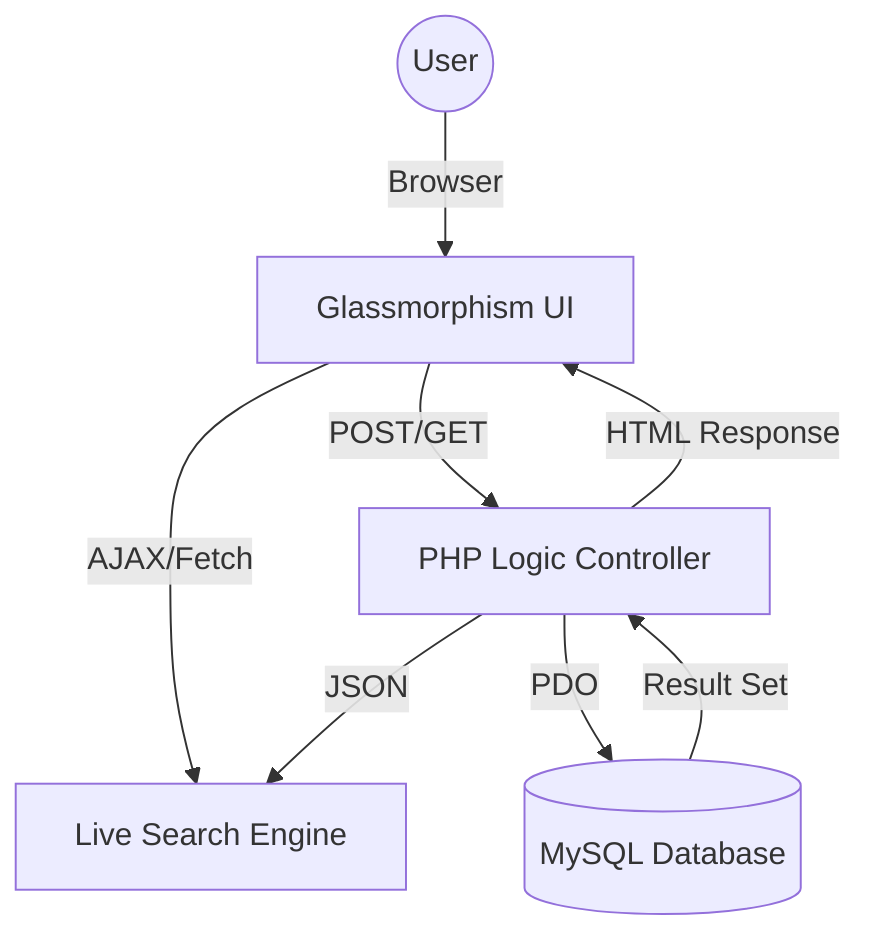
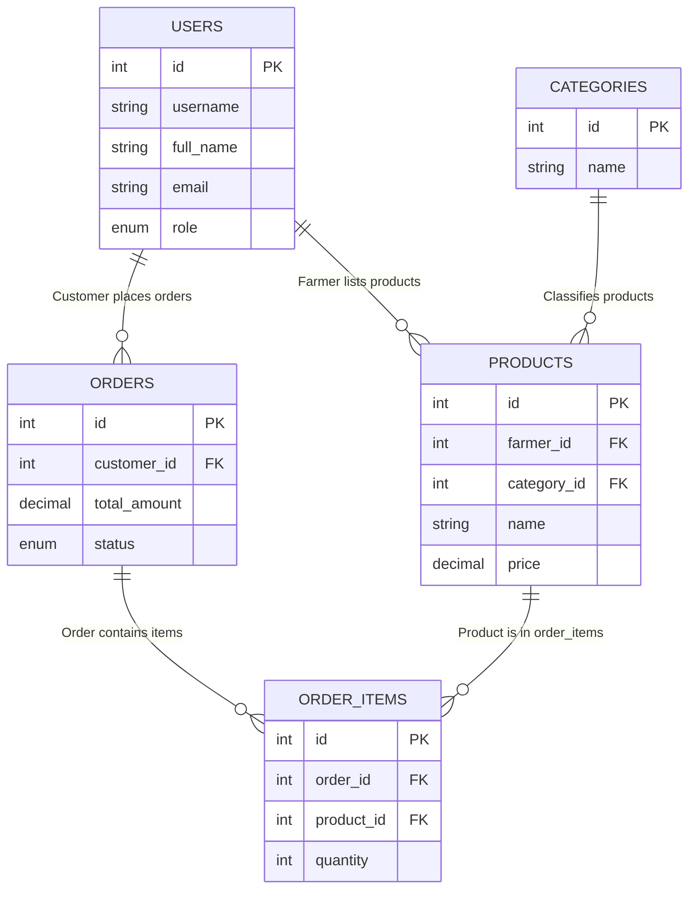

  

  

🔗 **Official Repository:** [github.com/kidanenamhret/Ethio-Farmers_Market](https://github.com/kidanenamhret/Ethio-Farmers_Market)

  

---

> [!IMPORTANT]
> **Ethio Farmers Market** is a premium, full-stack e-commerce solution designed specifically for the Ethiopian agricultural landscape. It connects local highland farmers directly to urban consumers through a high-performance, secure, and visually stunning digital marketplace.

---

## 📌 Project Overview

**Ethio Farmers Market** solves a critical real-world problem by eliminating exploitative middlemen in the agricultural supply chain. By providing a direct bridge, we ensure that farmers from regions like Debre Zeit, Ambo, and Bishoftu receive fair profits while consumers in Addis Ababa enjoy the freshest, organic produce.

This project was developed as a flagship submission for the **Web Programming** course, demonstrating mastery of the Vanilla PHP/MySQL/JS stack without the use of external frameworks.

---

## 🛠️ Technologies Used

  

---

## 📈 Project Metrics & Vitality

> [!NOTE]
> The following metrics provide real-time proof of active development and project vitality, ensuring full compliance with **Academic Integrity** standards by demonstrating the iterative progress of the codebase.

  

  

---

## 👥 Team Contributions & Task Classification

To ensure a robust and specialized development process, the project was divided into core functional modules:

| Team Member | Primary Role | Key Responsibilities & Tasks |
| :--- | :--- | :--- |
| **Mesfin Alemayehu** | **System Architect** | Database schema design, ERD modeling, and MySQL normalization. |
| **Biruktawit Geresu** | **UI/UX Lead** | Glassmorphism design system, responsive CSS architecture, and branding. |
| **Yonas Tadese** | **Backend Developer** | PHP logic controller, Session management, and Role-Based Access (RBAC). |
| **Edget Adissu** | **Full-Stack Engineer** | AJAX-powered live search engine and asynchronous product filtering. |
| **Ebsitu Birhanu** | **QA & Documentation** | System testing, SQL seeding, and technical documentation/README. |

---

## 🏗️ Project Architecture

---

## 🌟 Key Features

<table>
  <tr>
    <td width="33%" align="center">
      
       
      <b>Live AJAX Search</b>
       
      Instant product discovery powered by asynchronous API requests, eliminating page reloads.
    </td>
    <td width="33%" align="center">
      
       
      <b>Farmer Dashboard</b>
       
      Dynamic previews and real-time inventory management with custom Glassmorphism UI.
    </td>
    <td width="33%" align="center">
      
       
      <b>Enterprise Security</b>
       
      Full PDO prepared statements, RBAC (Role-Based Access Control), and session safety.
    </td>
  </tr>
</table>

---

## 📂 Database Architecture (ERD)

The system utilizes a high-performance relational database with 5 interconnected tables. Below is the Entity Relationship Diagram:

### Relationship Breakdown:
*   **One-to-Many**: Users to Products, Users to Orders, Categories to Products.
*   **Many-to-Many**: Orders to Products (linked via the `order_items` bridge table).

---

## 🏗️ Core System Modules

   <b>Marketplace Engine</b> &nbsp;&nbsp;&nbsp;
   <b>RBAC User Portal</b> &nbsp;&nbsp;&nbsp;
   <b>Secure Transaction Gateway</b>

---

  

---

## 🚀 Setup & Installation Instructions

1. **Environment**: Ensure you have **XAMPP** or **WAMP** installed on your system.
2. **Database Setup**:
   - Open **phpMyAdmin**.
   - Create a new database named `ethio_farmers_market`.
   - Import the SQL file located at: `/sql/ethio_farmers_market.sql`.
3. **File Deployment**:
   - Copy the entire `ethio-farmers-market` project folder into your server's root directory (e.g., `C:/xampp/htdocs/`).
4. **Configuration**:
   - If your MySQL credentials differ from the default (host: localhost, user: root, pass: ""), update the configuration in `/config/database.php`.
5. **Access**:
   - Open your browser and navigate to: `http://localhost/ethio-farmers-market/public/index.php`.

---

  <strong>Web Programming Course - Final Group Project</strong>

  <b>Group Members:</b> 
  Mesfin Alemayehu • Biruktawit Geresu • Yonas Tadese • Edget Adissu • Ebsitu Birhanu

  

---

## 🔐 User Roles & Demo Credentials

To test the full functionality of the marketplace, you can use the following pre-seeded demo accounts. **The password for all accounts is `password123`.**

| Role | Email Address | Description |
| :--- | :--- | :--- |
| **Admin** | `admin@ethiofarmers.com` | Full marketplace oversight. Can manage all users, view global sales, and verify product categories. |
| **Farmer** | `farmer@demo.com` | Can list new products, manage inventory (Edit/Delete), and view incoming orders for their produce. |
| **Customer** | `tigist@buyer.com` | Standard buyer role. Can browse the marketplace, manage their cart, place orders, and track history. |

### Role Permissions Details

- **Customer**:
  - Access to the public marketplace.
  - Session-based shopping cart management.
  - Checkout and order tracking (My Orders).
- **Farmer**:
  - All Customer features (Farmers can also buy).
  - Personal **Farmer Dashboard**.
  - **Add/Edit/Delete** products.
  - Track sales and stock levels.
- **Administrator**:
  - All Customer features.
  - **Admin Panel** access.
  - View all registered users and global transaction history.
  - User verification and category management.

---

## 📜 Academic Integrity & Compliance

- **No Frameworks**: Built entirely using vanilla technologies as per course restrictions.
- **Security**: Implements PDO prepared statements to prevent SQL Injection and `password_hash()` for security.
- **AJAX Requirement**: Asynchronous live search implemented in `assets/js/live-search.js` and `ajax/live-search.php`.

---

  

  <a href="#-ethio-farmers-market"><b>Back to Top ⬆️</b></a>

  <strong>Web Programming Course - Group Project</strong> 
  © 2026 Ethio Farmers Market. Supporting local agriculture through technology.

