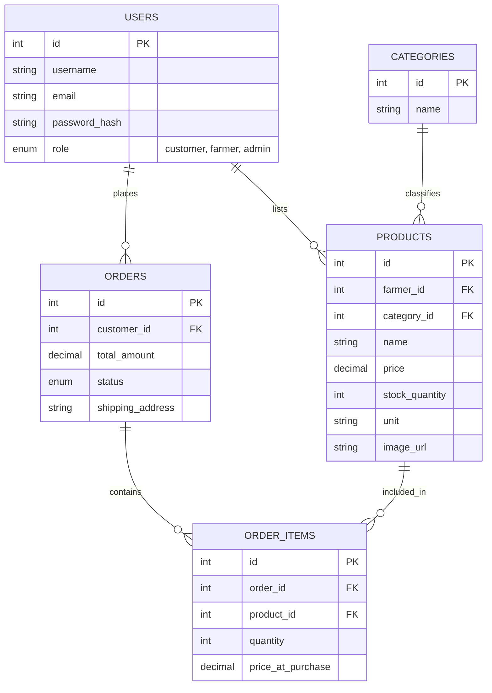
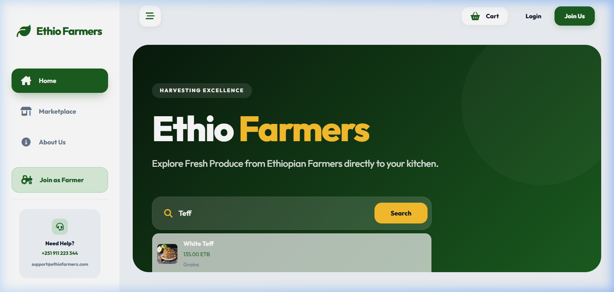
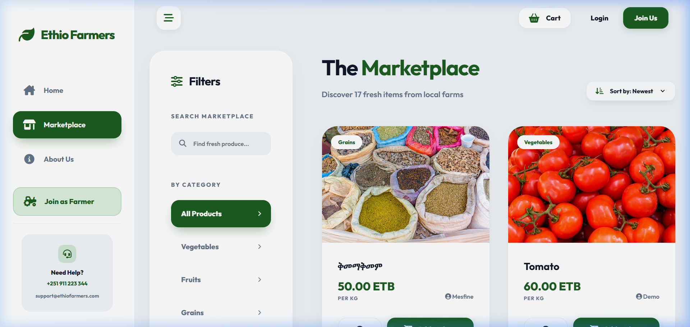
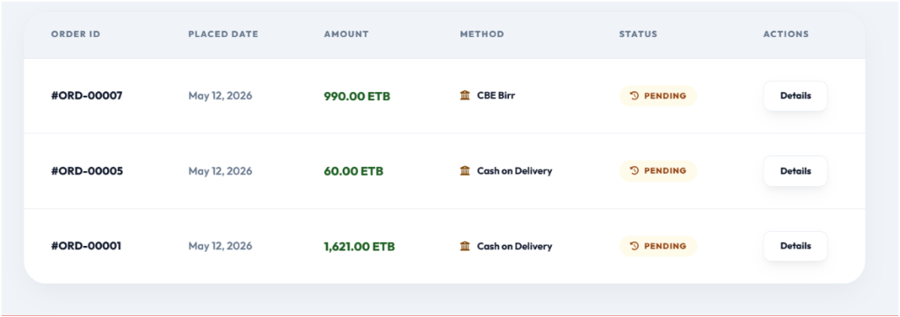
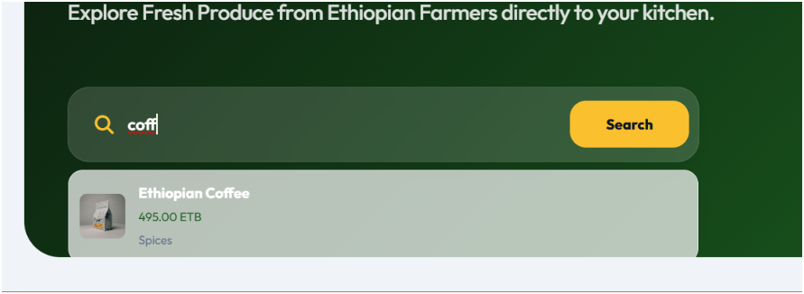
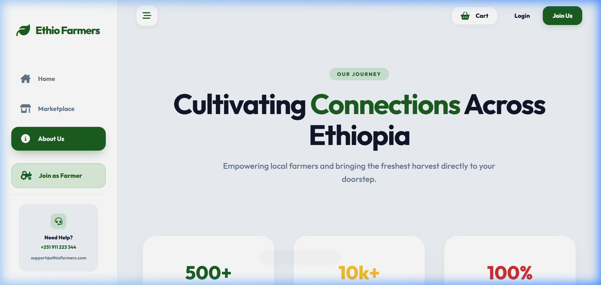

# Ethio Farmers Market - Project Documentation

## 🌾 Overview

**Ethio Farmers Market** is a localized e-commerce platform designed to bridge the gap between Ethiopian farmers and consumers. It empowers local farmers to sell their organic produce directly to customers, ensuring fresh products for buyers and fair profits for growers.

---

## 🛠️ Tech Stack

- **Frontend**: HTML5, Vanilla CSS3 (Custom Design System), JavaScript (ES6+).
- **Backend**: PHP 8.x (Procedural & Functional logic).
- **Database**: MySQL (PDO for secure connections).
- **UI Style**: Premium Glassmorphism, Responsive Grid Layout.

---

## 📂 Project Structure

- `/assets`: CSS, JS, and UI images.
- `/config`: Database connection (PDO).
- `/includes`: Core logic (Auth, Sessions, Header/Footer).
- `/public`: User-facing pages.
  - `/farmer`: Farmer dashboard and inventory management.
  - `/admin`: Platform administration and reporting.
- `/ajax`: Real-time search endpoints.
- `/sql`: Database schema and sample data.

---

## 👥 Classification of Roles

### 🏛️ System Roles (Platform Access)

1. **Guest (Unauthenticated)**
   - Browse the marketplace and view product details.
   - Use the AJAX-powered live search.
   - Register as either a Customer or a Farmer.

2. **Customer**
   - Manage a persistent shopping cart.
   - Securely place orders for fresh produce.
   - Access a personalized order history and tracking dashboard.

3. **Farmer**
   - Access a specialized **Farmer Dashboard** with sales analytics.
   - **Harvest Management (CRUD)**: Add, edit, and delete product listings.
   - **Order Fulfillment**: Track incoming orders and update shipping statuses.
   - Manage inventory levels and product images.

4. **Administrator**
   - **User Governance**: Manage, verify, or remove user accounts.
   - **Content Control**: Oversee all product listings and manage categories.
   - **Platform Monitoring**: Access high-level stats across the entire ecosystem.

---

### 💻 Development Team Roles (Project Execution)

- **Mesfin Alemayehu**: **Frontend Developer** - Lead implementation of core PHP logic and database integration.
- **Edget Adissu**: **System Architect** - Designed the application structure and backend routing.
- **Yonas Tadese**: **Database & Security Specialist** - Responsible for PDO security and SQL schema integrity.
- **Ebsitu Birhanu**: **UI/UX Designer** - Crafted the Premium Glassmorphism design and custom CSS system.
- **Biruktawit Geresu**: **DevOps & QA** - Managed project deployment, file naming standards, and final testing.

---

---

## 🚀 Setup Instructions

1. **Local Server**: Install XAMPP or WAMP.
2. **Database**:
   - Open phpMyAdmin.
   - Create a new database named `ethio_farmers_market`.
   - Import the file `sql/ethio_farmers_market.sql`.
3. **File Deployment**:
   - Copy the project folder to `C:/xampp/htdocs/`.
4. **Configuration**:
   - Update `config/database.php` if your MySQL password is not empty.
5. **Access**:
   - Visit `http://localhost/ethio-farmers-market/public/index.php`.

---

## 🔑 Default Credentials (Demo)

- **Admin**: `admin@ethiofarmers.com` / `password`
- **Farmer**: (Register a new account or check `users` table after migration)

---

## ✨ Key Features

1. **Premium Aesthetic**: Modern Ethio-Green palette with glassmorphism effects.
2. **Role-Based Access**: Specialized dashboards for Farmers and Admins.
3. **Live Search**: AJAX-powered search for instant product discovery.
4. **Inventory Management**: Farmers can add, edit, and track their stock.
5. **Secure Checkout**: Transaction handling with simulated payment methods.

---

## 📊 Database Schema (ERD)

The following diagram illustrates the relational structure of the **Ethio Farmers Market** database:

---

## 📸 Application Screenshots (UI)

### 🏠 1. Landing Page (Home)

The entrance to the marketplace, featuring a premium glassmorphism search bar and featured categories.

### 🛒 2. Marketplace & Search

Real-time filtering by category and AJAX-powered live search.

### 🚜 3. Farmer Dashboard

Comprehensive analytics and inventory management for agricultural sellers.

### 📦 4. Order Management

Farmers can track incoming orders and update delivery statuses in real-time.

### ℹ️ 5. About Us Page

Sharing the platform's mission and impact through data visualization and storytelling.

---
